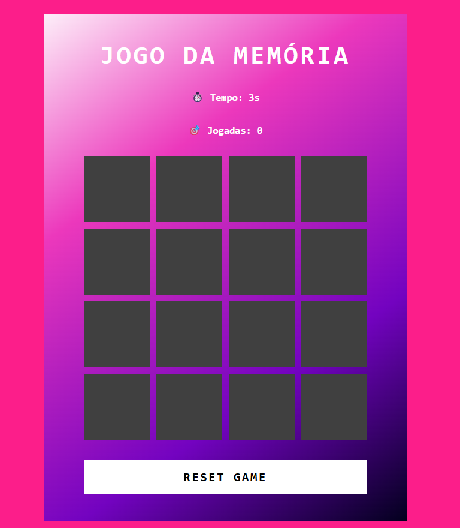

# 🧠 Jogo da Memória

Este é um mini **jogo da memória** desenvolvido com **HTML, CSS e JavaScript puro**, baseado em um desafio da [Digital Innovation One (DIO)](https://web.dio.me/). A proposta é encontrar os pares de emojis idênticos no menor tempo e com o menor número de jogadas possível.

## 📌 Objetivo do Jogo

- Clique nas cartas para revelá-las.
- Encontre os pares iguais.
- Complete todos os pares para vencer!

## 🔧 Melhorias Implementadas

Além da versão original da DIO, foram adicionadas as seguintes funcionalidades:

### ✅ Contador de Jogadas

- Cada par tentado (duas cartas abertas) aumenta o número de jogadas.
- O contador é exibido dinamicamente na tela.

### ⏱️ Cronômetro de Tempo

- O tempo é contado em segundos desde o início do jogo.
- Ao vencer, o tempo total é exibido em uma mensagem.
  
### 🏁 Mensagem de Vitória Personalizada

- Ao combinar todos os pares, o jogo mostra uma mensagem com o **tempo total** e **número de jogadas** realizadas.

## 💻 Tecnologias Utilizadas

📸 Preview

## 📚 Créditos

Projeto original fornecido pela [Digital Innovation One (DIO)](https://dio.me).  
Melhorias implementadas por Cristiane Machado.
